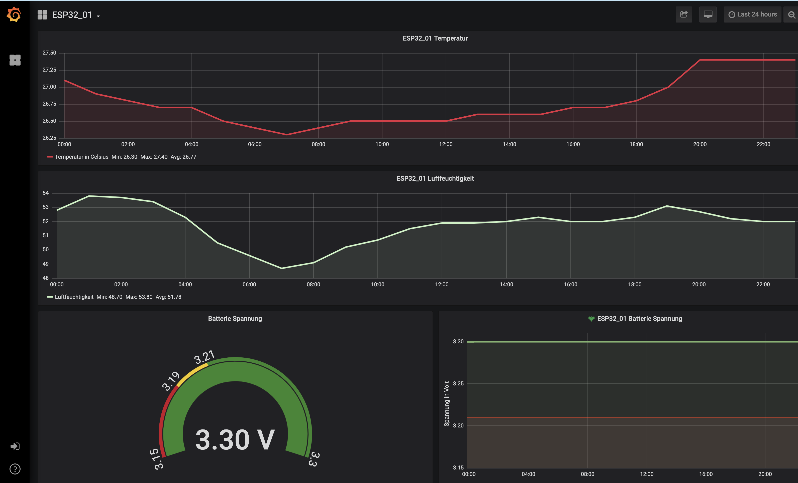
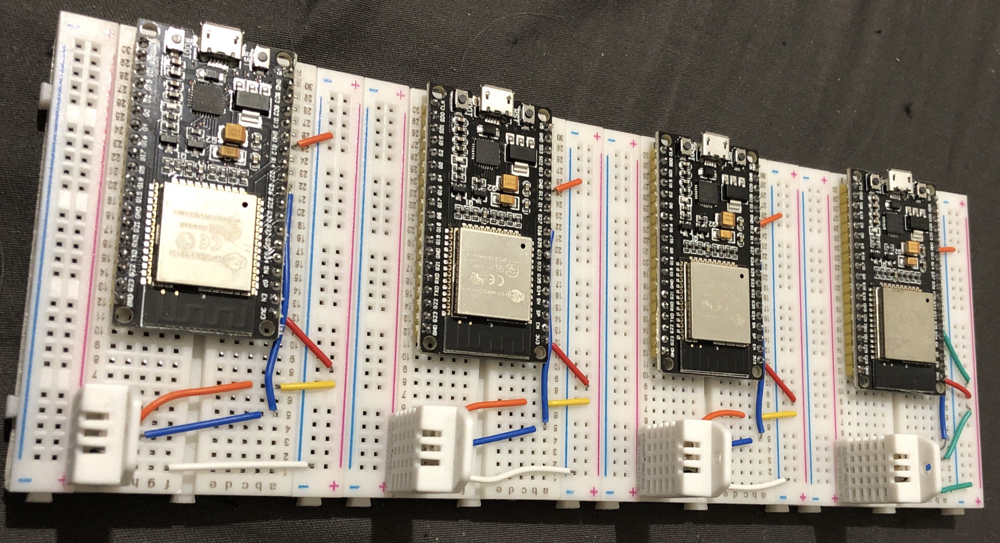
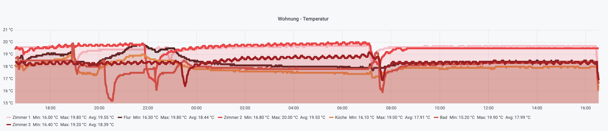
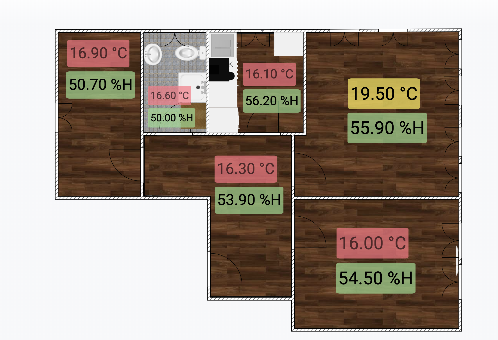

# Process DHT22 sensor data via ESP32 microcontroller and publish data via MQTT

ESP32 nodeMCU connects to WiFi and MQTT broker, syncs time and sends DHT22 temperature and humidity sensor data in JSON format via MQTT.

***My setup:***

The data is send to my Mosquitto broker which runs on Ubuntu 18.04.02 LTS. For visualisation and smart home hub I use Grafana and Openhab2.

In Openhab2 I defined items for the temperature, humidity and battery voltage data. Each time the values are published in MQTT the server reads them and displays them on my sitemap.

  

To get a history of the measurements, the data will be saved to an Influx database in a defined interval.  

This database is connected to Grafana. This allows me to create a dashboard to display the sensor data, create alerts and compare values with historical data.

  

  

  

In order to be able to interpret the data at a glance, the sensor data are displayed for the respective room. As soon as a threshold value for the air humidity is reached, an alert is sent via telegram with the hint to open the window in the respective room.

  

